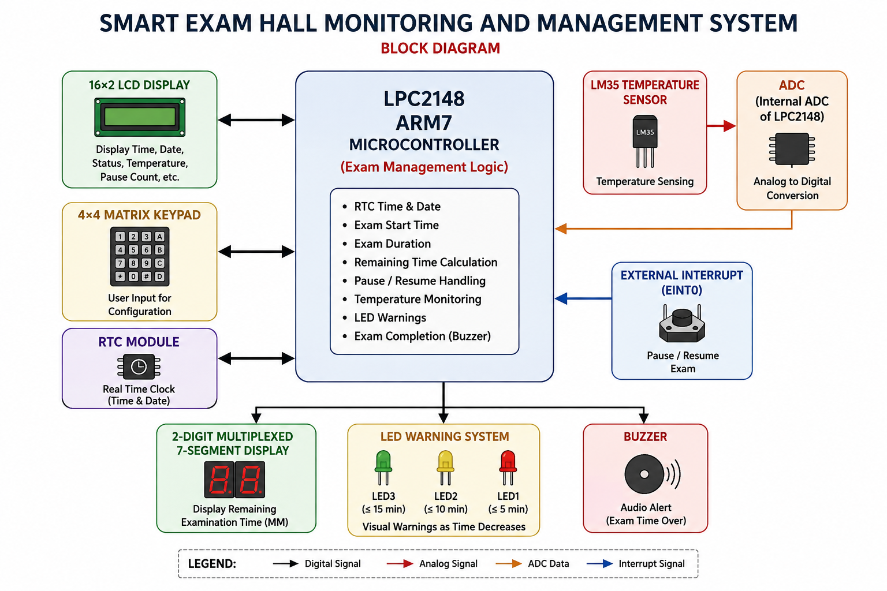
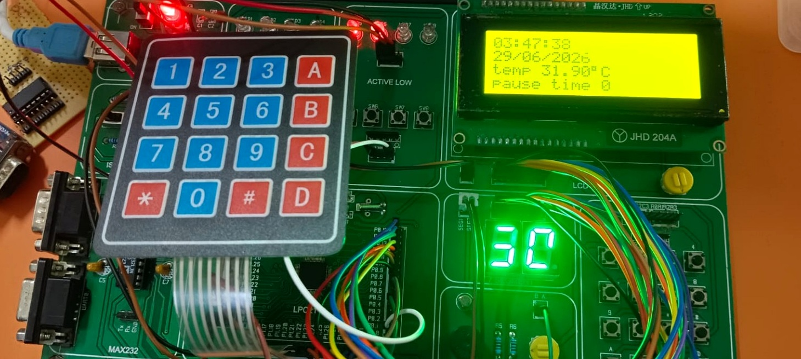
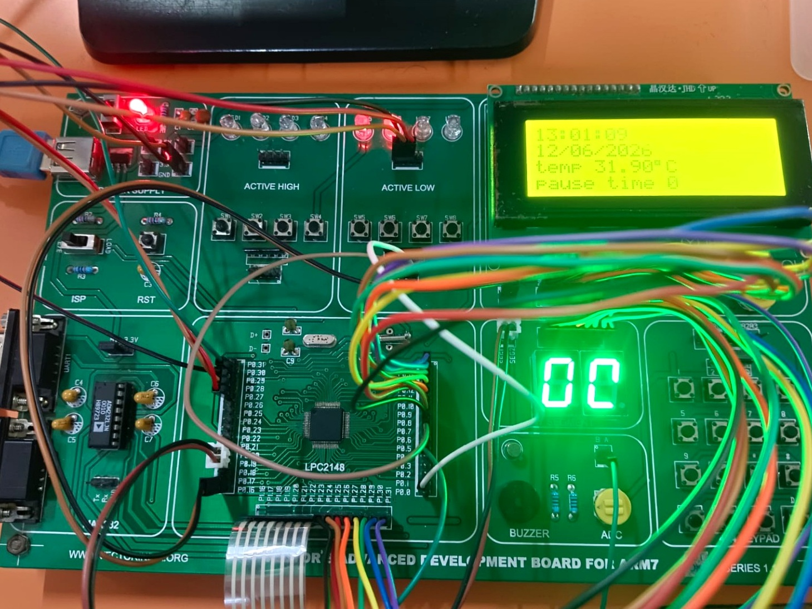
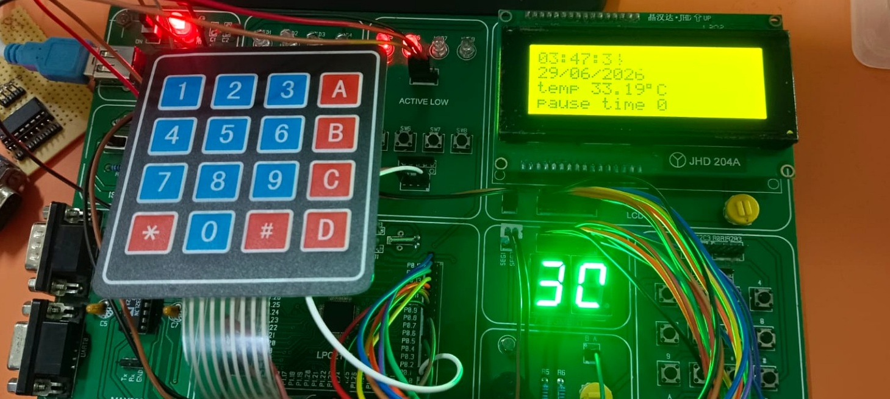

# Smart Exam Hall Monitoring and Management System

An embedded system based on the **LPC2148 ARM7 microcontroller** designed to monitor and manage examination hall activities using a real-time clock, temperature monitoring, keypad-based configuration, countdown timing, multiplexed seven-segment displays, LCD, LEDs, and external interrupts.

## 📌 Project Overview

The **Smart Exam Hall Monitoring and Management System** provides an embedded solution for managing important examination-hall parameters such as exam duration, start time, room temperature, and countdown status.

The **LPC2148 ARM7 microcontroller** acts as the main controller and interfaces with multiple peripherals including the DS1307 RTC, LM35 temperature sensor, 16×2 LCD, 4×4 keypad, seven-segment displays, LEDs, and external interrupt inputs.

## 📋 Project Details

| Category                    | Details                                          |
| --------------------------- | ------------------------------------------------ |
| **Project Type**            | Embedded Systems / Microcontroller Project       |
| **Project Title**           | Smart Exam Hall Monitoring and Management System |
| **Microcontroller**         | LPC2148 ARM7                                     |
| **Programming Language**    | Embedded C                                       |
| **Domain**                  | Embedded Systems                                 |
| **Development Environment** | Keil µVision                                     |
| **Programming Tool**        | Flash Magic                                      |
| **Communication Protocols** | I2C, UART                                        |
| **Main Interfaces**         | GPIO, ADC, LCD, Keypad, RTC, External Interrupts |

## 🎯 Objectives

* Monitor and display the current time and examination status.
* Measure and display examination hall temperature.
* Configure examination duration using a keypad.
* Provide a real-time countdown timer during the examination.
* Display the remaining examination time using multiplexed seven-segment displays.
* Provide LED indications for examination states.
* Allow password-protected RTC configuration.
* Use external interrupts for exam start-time configuration and pause/resume control.

## ⚙️ Key Features

* **Real-Time Clock:** DS1307 RTC for maintaining current time.
* **Temperature Monitoring:** LM35 temperature sensor interfaced through the LPC2148 ADC.
* **Exam Duration Configuration:** 4×4 keypad for user input.
* **Countdown Timer:** Displays the remaining examination time.
* **Multiplexed Display:** Seven-segment displays used for timer visualization.
* **LCD Interface:** 16×2 LCD for displaying system information.
* **Password Protection:** Restricts RTC configuration to authorized users.
* **External Interrupts:** Used for exam start-time configuration and pause/resume functionality.
* **LED Alerts:** Provides visual indication of system/examination status.

## 🧰 Hardware Components

| Component                     | Purpose                                           |
| ----------------------------- | ------------------------------------------------- |
| **LPC2148 ARM7 MCU**          | Main controller                                   |
| **DS1307 RTC**                | Real-time clock                                   |
| **LM35 Temperature Sensor**   | Temperature measurement                           |
| **16×2 LCD**                  | Displays time, temperature and system information |
| **4×4 Keypad**                | User input and exam configuration                 |
| **7-Segment Displays**        | Countdown timer display                           |
| **LEDs**                      | Status and alert indication                       |
| **External Interrupt Inputs** | Exam control functions                            |

## 💻 Software & Technologies

* **Embedded C**
* **ARM7 / LPC2148**
* **Keil µVision**
* **Flash Magic**
* **UART**
* **I2C**
* **ADC**
* **GPIO**
* **External Interrupts**
* **Timers / Delay Functions**

## 🔌 Peripheral Interfaces

### DS1307 RTC – I2C

The DS1307 RTC communicates with the LPC2148 using the **I2C protocol**.

* RTC Slave Address: `0x68`
* SCL: `P0.2`
* SDA: `P0.3`

The RTC is used to obtain and configure the examination hall's real-time clock.

### LM35 – ADC

The LM35 provides an analog voltage proportional to temperature. The LPC2148 **ADC** converts this analog signal into a digital value, which is processed and displayed on the LCD.

### 4×4 Keypad

The 4×4 matrix keypad is used for:

* Entering examination duration
* Configuring time
* Password entry
* User interaction with the system

### Seven-Segment Display

Multiplexed seven-segment displays are used to show the **remaining examination time**.

### External Interrupts

External interrupts provide event-driven control without continuously polling the input.

* **EINT0:** Used for examination start-time configuration.
* **EINT1:** Used for pause/resume control.

## 🏗️ System Architecture

The LPC2148 acts as the central controller and communicates with the connected peripherals.



## 🔄 System Working

### 1. System Initialization

The LPC2148 initializes the required GPIO pins and peripheral interfaces such as:

* LCD
* Keypad
* ADC
* I2C
* RTC
* Seven-segment display
* External interrupts

### 2. Real-Time Monitoring

The DS1307 provides the current time, while the LM35 measures the examination hall temperature.

The system displays relevant information on the **16×2 LCD**.

### 3. Exam Configuration

The user enters the required examination duration through the **4×4 keypad**.

The configured duration is used by the system to start the countdown.

### 4. Countdown Operation

Once the examination starts, the system maintains the remaining examination time and displays it using multiplexed seven-segment displays.

### 5. Pause / Resume

The system uses an external interrupt to pause or resume the examination countdown when required.

### 6. Time Configuration

RTC configuration is protected using a password mechanism. Authorized input allows the real-time clock settings to be modified.

### 7. Alerts

LED indicators provide visual feedback for relevant examination states.

## 📷 Project Images

### 🔢 Keypad and LCD Display

The 4×4 matrix keypad is used for user input and configuration, while the LCD displays system information, examination status, temperature, and other parameters.



### 🔧 Project Hardware

The complete hardware setup of the **Smart Exam Hall Monitoring and Management System**.



### 🌡️ Temperature Display

The LM35 temperature sensor is interfaced with the LPC2148 ADC, and the measured temperature is displayed on the LCD.



## 📁 Project Structure

```text
Smart-Exam-Hall-Monitoring-System/
│
├── project_images/
│   ├── keypad_and_display.jpg.jpeg
│   ├── project_hardware.jpg.jpeg
│   └── temperature_display.jpg.jpeg
│
├── system_architecture.png
│
├── src/
│   └── [source files]
│
├── include/
│   └── [header files]
│
└── README.md
```

## 🧠 Concepts Demonstrated

This project demonstrates practical experience with:

* Embedded C programming
* ARM7 architecture
* LPC2148 microcontroller programming
* GPIO configuration
* ADC interfacing
* I2C communication
* RTC interfacing
* LCD interfacing
* Matrix keypad interfacing
* Seven-segment multiplexing
* External interrupt handling
* Timer-based applications
* Embedded system integration
* Hardware–software interfacing

## 🚀 Future Enhancements

Possible improvements include:

* Adding data logging for examination events.
* Adding a buzzer for audible alerts.
* Integrating wireless monitoring.
* Adding centralized monitoring for multiple examination halls.
* Storing examination configuration in non-volatile memory.

## 👨‍💻 Author

**Mahesh Gaigula**

**B.Tech – Electronics and Communication Engineering (ECE)**

GitHub: [maheshgaigula](https://github.com/maheshgaigula)

## 📌 Project Information

**Project:** Smart Exam Hall Monitoring and Management System
**Project Type:** Embedded Systems / Microcontroller Project
**Controller:** LPC2148 ARM7
**Programming Language:** Embedded C
**Domain:** Embedded Systems
**Development Environment:** Keil µVision

---

⭐ **This project demonstrates practical implementation of an embedded system by integrating multiple peripherals with the LPC2148 ARM7 microcontroller.**
